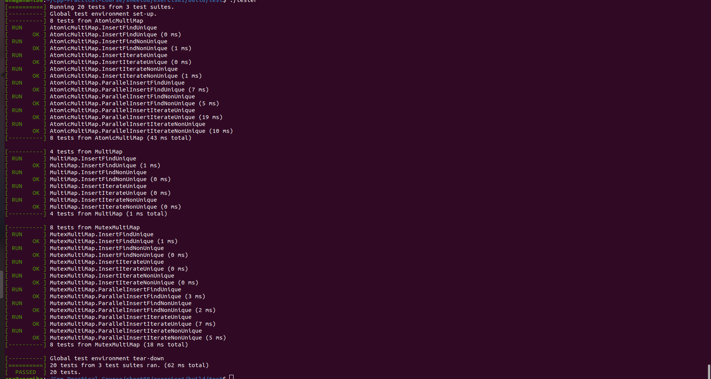

# Cpp-Practical-Course
This repo includes the programming tasks that I worked on during the practical course: Sytems Programming in C++ in the summer semester 2021.

Sheets 1 and 2 are not included, since they don't contain any programming tasks, just a familiarization with the Linux system and Git. 

The C++ code adheres to the C++20 style.

Compilation of the programs was developed with CMake and Makefiles. 

This repo will most likely only run on a Linux system.

# Guidelines
Start by cloning this repo wherever you like.

Each programming sheet contains a various number of exercices and a ```.pdf``` file with explanations of the tasks. 

The code is already compiled and can be run by accessing the ```build``` folder within each exercice.

You can go ahead and and run the executable:
```bash 
./tester
```
on your terminal which can be found in the ```test``` folder which is located inside the ```build``` folder.

Afterwards, a number of tests that were used to grade the tasks will be running.

An example can be seen here:


Some of the exercices also include executables inside the ```lib``` folder which can also used to interact more actively with the code.

# Short Overview of the Contents

## Sheet03
### Exercice 1
This exercice was about implementing a binary heap and also printing it in the ```.dot``` format.
### Exercice 2
The main purpose of this exercice was to play around with raw pointers.
### Exercice 3
Here we had to implement the object representation of doubles and floats by using the mantissa and the exponent. 
The goal was to familiarize oneself with using the ***std::byte*** object and bit functions.

## Sheet04
### Exercice 1
This exercice was about understanding how to implement classes.
### Exercice 2
Here we had to implement a bitset and we also learned how to build iterators on our own.

## Sheet05
### Exercice 1
This exercice was about implementing a chaining hash table with generic values.
We experimented with smart pointers and how to build RAII wrappers on our own. 
Also, copy and move constructurs were implemented.
### Exercice 2
Here the scope was to build a command line where a user could add and delete folders and files.
Again, we experimented with RAII wrappers.

## Sheet06
### Exercice 1
The purpose of this exercice was to play around with polymorphy and class hierarchy. 
Within this scope, the programming task was to implement an abstract syntax tree that can be evaluated, optimized and printed.

## Sheet07
### Exercice 1
This exercice was about implementing allocators of our own inside a doubly linked list.
Also, templates were covered within this exercice.

## Sheet08
### Exercice 1
Here we experimented with multi-threading synchronization with mutexes and atomics.

## Final
This folder contains the final project that we had to develop during this course. 
The project was about building a compiler for a simple programming language that was given on the sheet.

